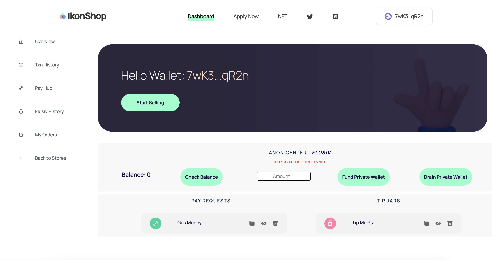
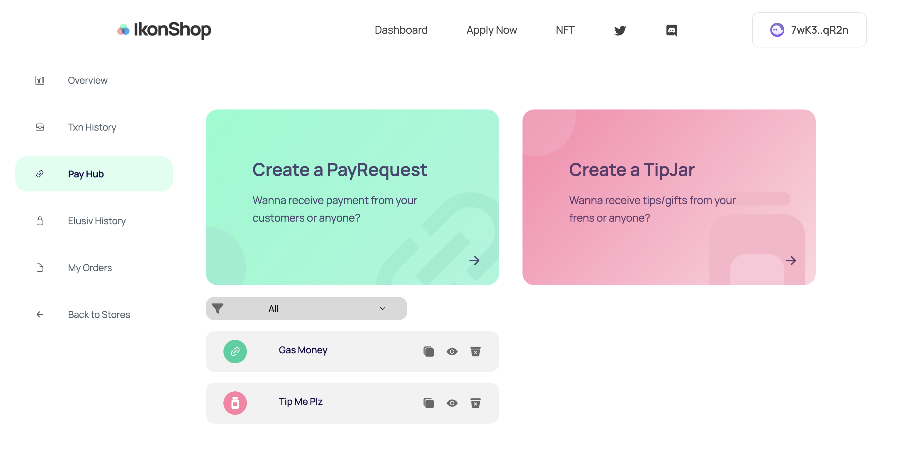
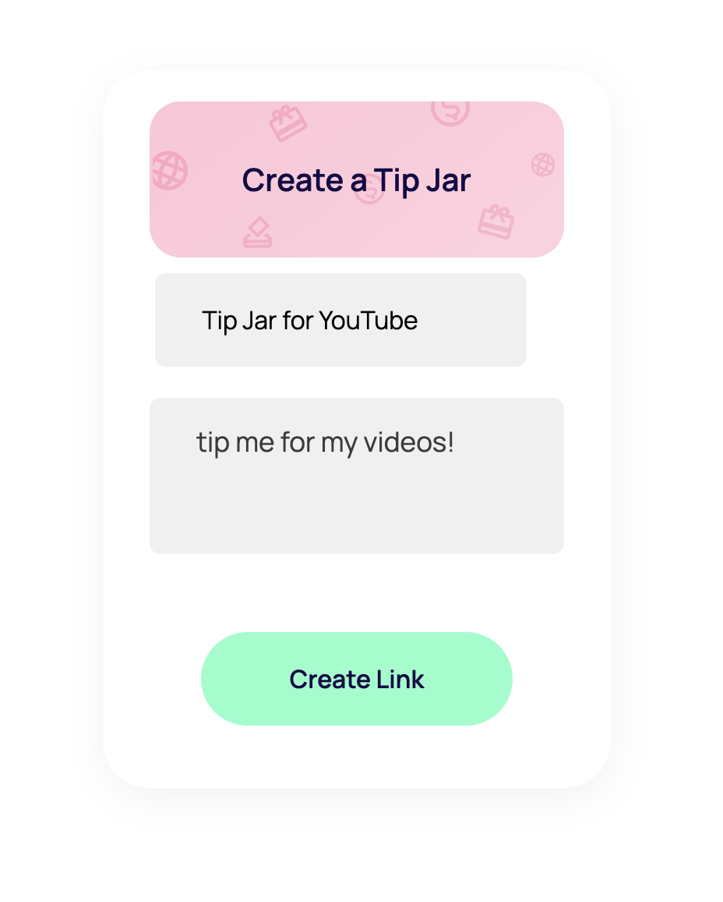
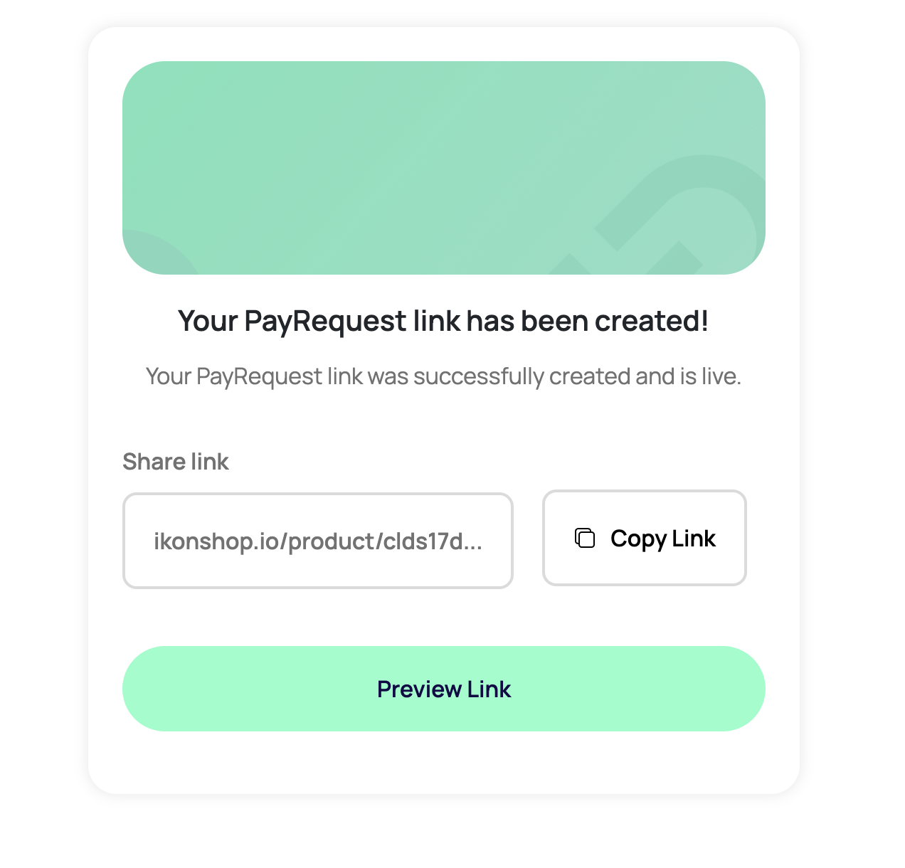
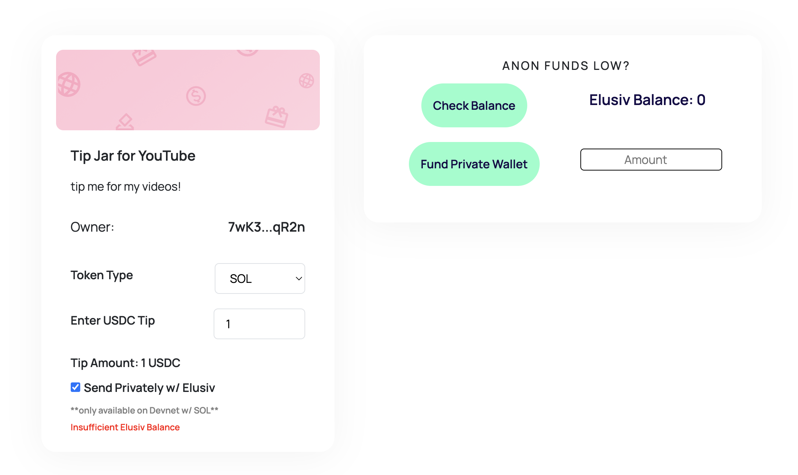
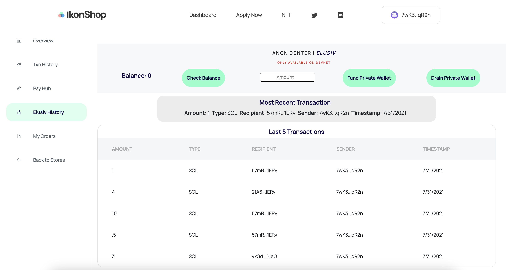
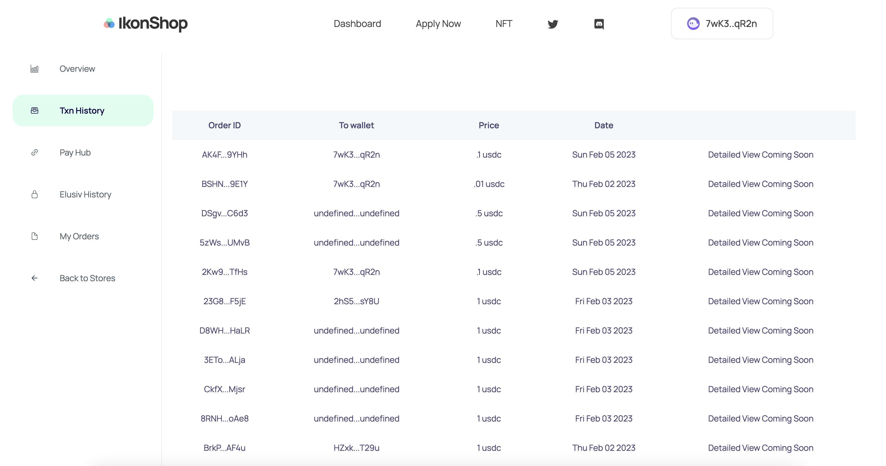

# IkonShop - A web3 platform for merchants and freelancers. 

**This repo is intended for the Encode Hackathon only.**

Pay, Tip, and Collect **anonymously** with zero fees.

IkonShop is a platform for merchants and freelancers who need to sell products and collect funds. With a GraphQL Database for products and Solana Pay for transaction execution, users are able to issue pay requests, create tip jars, and collect payment at lightning speed. Mix in the Elusiv SDK and users now have an option to send payment anonymously as well (only on Devnet for now).

Most Tip Jar or Invoicing platforms charge their users around 5% of the transaction as a fee. By leveraging both the speed and low-gas fees on the Solana Blockchain, IkonShop is able to provide a seamless way for anyone to collect funds or tips directly to their wallet with out the platform taking a cut.

Our goal for the Encode Hackathon was to demonstrate IkonShop's primary features of payment request/collection combined with Elusiv for an anonymous option. 

[Live Site](https://ikon-shop-encode.vercel.app/)

## Getting Started
To get the repo running locally execute the commands below in your terminal.

```shx
git clone https://github.com/Ikonshop/ikon_shop_encode.git
cd ikon_shop_encode
npm install
npm run dev
```

rename `.env.local` to `.env`

## Usage

To test our site, you can first connect your Solana Wallet and navigate to the User Dashboard



From there, you can either click 'Start Selling' or navigate to the 'Pay Hub' on the left.

The Pay Hub allows you create either Pay Request links (where the price is pre-set) or a Tip Jar (where the tipper inputs the amount).



 Here, we will demo the Tip Jar.



After creating the Tip Jar, or Pay Request, the user is provided with a link.



From the link the user can then issue payment using Solana Pay and can opt to do so privately (on Devnet) with Elusiv.



Our Dashboard makes it easy to view past private transactions made through Elusiv, as well as your Mainnet transactions on our platform.





## Prerequisites
[NPM](https://www.npmjs.com)

[Phantom Wallet](https://phantom.app/) ***(or any solana wallet)***

## Contributing

If interested in contributing, reach out to the team on Discord!


## License

This project is licensed under the MIT License

## Contact
[IkonShop Twitter](https://twitter.com/ikonshopapp)

[IkonShop Discord](https://discord.gg/ikons)

## Acknowledgments
[Matt Weichel](https://twitter.com/topshotturtles)

[Mike Kruz](https://twitter.com/kruzsol)

[Henry Ugo](https://twitter.com/uncensored_ugo)

